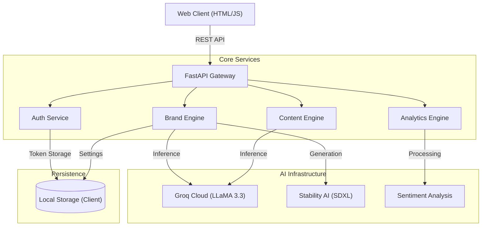

[](https://www.python.org/downloads/)
[](https://fastapi.tiangolo.com)
[](https://stability.ai/)

**BizForge** is a scalable, GenAI-native platform designed to democratize professional branding and business intelligence. By leveraging large language models (LLaMA-3) and state-of-the-art image generation (SDXL), it automates high-value creative and analytical workflows for enterprises and SMEs.

---

## 🏗️ System Architecture

BizForge follows a modern **Microservices-ready** architecture, decoupling the AI inference layer from the business logic handling.



## 🚀 Key Capabilities

### 🧠 Generative AI Core
- **Advanced NLP Engine**: Utilizes LLaMA-3.3-70b for context-aware content generation, delivering human-parity marketing copy and strategic insights.
- **Visual Synthesis**: Integrates Stability AI SDXL for vector-grade logo generation and visual asset creation.
- **Sentiment Analysis**: Real-time NLP processing of customer feedback to derive actionable business intelligence.

### 💼 Business Value
- **Scalable Architecture**: Built on FastAPI for high-performance, asynchronous request handling suitable for high-concurrency environments.
- **Secure Authentication**: Implements Google OAuth 2.0 and JWT standards for enterprise-grade security.
- **Data-Driven Insights**: Provides real-time analytics on brand performance and customer sentiment.

## 🛠️ Technology Stack

| Component | Technology | Rationale |
|-----------|------------|-----------|
| **Backend** | Python 3.10+, FastAPI | High-performance, async support, native Pydantic integration for data validation. |
| **Frontend** | Vanilla JS, HTML5, CSS3 | Lightweight, zero-dependency client optimized for speed and compatibility. |
| **AI Ops** | Groq Cloud, Stability AI | Best-in-class inference speeds (Groq) and image quality (SDXL). |
| **Auth** | OAuth 2.0 (Google) | Industry-standard secure delegation protocol. |

## 🔧 Local Development Setup

### Prerequisites
- Python 3.10+

- API Keys: Groq Cloud, Stability AI, Google Cloud

### Installation

1.  **Clone the repository**
    ```bash
    git clone https://github.com/Vatsal16-1308/BrandCraft.git
    cd BrandCraft
    ```

2.  **Environment Configuration**
    ```bash
    cp .env.example .env
    # Populate .env with your API credentials
    ```

3.  **Install Dependencies**
    ```bash
    pip install -r requirements.txt
    ```

4.  **Launch Server**
    ```bash
    uvicorn app.main:app --reload
    ```

## 🛣️ Roadmap

### Phase 1: MVP (Current)
- **Client-Side Storage**: Leverages browser LocalStorage for zero-latency user preferences and token management.
- **Stateless Architecture**: Maximizes scalability and reduces infrastructure costs.

### Phase 2: Enterprise Scaling (Planned)
- **Centralized Persistence**: Migration to **MongoDB Atlas** for cross-device synchronization.
- **Advanced User Roles**: Implementation of RBAC (Role-Based Access Control) for team collaboration.

## 🤝 Contributing

We welcome contributions that align with our mission of accessible business intelligence. Please feel free to submit a Pull Request.


