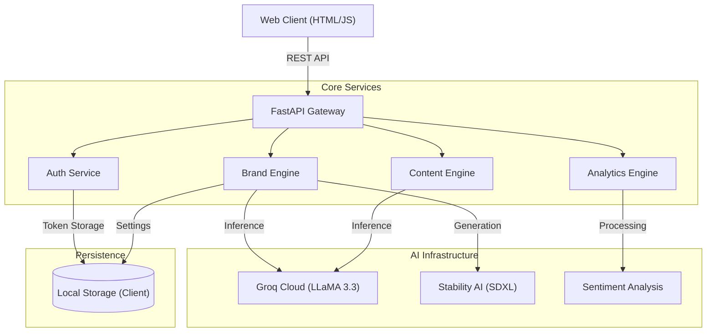
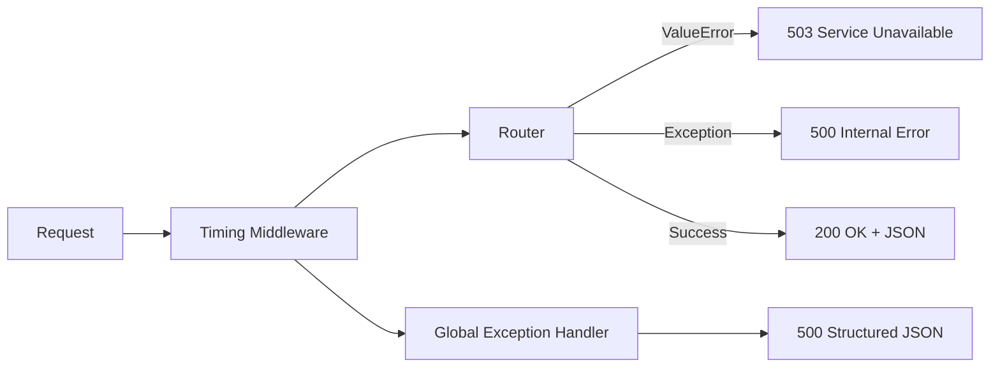

[](https://www.python.org/downloads/)
[](https://fastapi.tiangolo.com)
[](https://stability.ai/)

**BizForge** is a scalable, GenAI-native platform designed to democratize professional branding and business intelligence. By leveraging large language models (LLaMA-3) and state-of-the-art image generation (SDXL), it automates high-value creative and analytical workflows for enterprises and SMEs.

---

## 🏗️ System Architecture

BizForge follows a modern **Microservices-ready** architecture, decoupling the AI inference layer from the business logic handling.



### Error Handling Architecture



- **Global Exception Handler**: Catches all unhandled exceptions and returns structured JSON `ErrorResponse`
- **Request Timing**: Every response includes `X-Process-Time` header; slow requests (>2s) are logged as warnings
- **Startup Validation**: API keys and configuration are verified on server boot
- **AI Service Retry**: Groq API calls include automatic retry with exponential backoff (2 retries, 2s/4s delays)
- **Frontend Timeouts**: All API calls use 45s AbortController timeout with user-friendly error messages

## 🚀 Key Capabilities

### 🧠 Generative AI Core
- **Advanced NLP Engine**: Utilizes LLaMA-3.3-70b for context-aware content generation, delivering human-parity marketing copy and strategic insights.
- **Visual Synthesis**: Integrates Stability AI SDXL for vector-grade logo generation and visual asset creation.
- **Sentiment Analysis**: Real-time NLP processing of customer feedback to derive actionable business intelligence.

### 💼 Business Value
- **Scalable Architecture**: Built on FastAPI for high-performance, asynchronous request handling.
- **Secure Authentication**: Implements Google OAuth 2.0 and JWT standards for enterprise-grade security.
- **Data-Driven Insights**: Real-time analytics on brand performance and customer sentiment.

### 📊 Impact Model
| Metric | Manual Process | BizForge | Savings |
|--------|---------------|----------|---------|
| Brand Name Research | 4-8 hours | 30 seconds | ~99% time saved |
| Logo Design Iteration | 3-5 days | 1 minute | ~99% time saved |
| Marketing Copy | 2-4 hours | 15 seconds | ~99% time saved |
| Design System | 1-2 weeks | 30 seconds | ~99% time saved |
| Brand Consultant | ₹25,000+/session | Free | 100% cost saved |

## 🛠️ Technology Stack

| Component | Technology | Rationale |
|-----------|------------|-----------|
| **Backend** | Python 3.10+, FastAPI | High-performance, async support, native Pydantic integration for data validation. |
| **Frontend** | Vanilla JS, HTML5, CSS3 | Lightweight, zero-dependency client optimized for speed and compatibility. |
| **AI Ops** | Groq Cloud, Stability AI | Best-in-class inference speeds (Groq) and image quality (SDXL). |
| **Auth** | OAuth 2.0 (Google) | Industry-standard secure delegation protocol. |

## 🔧 Local Development Setup

### Prerequisites
- Python 3.10+
- API Keys: Groq Cloud (required), Stability AI (optional), Google Cloud (optional)

### Installation

1.  **Clone the repository**
    ```bash
    git clone https://github.com/Vatsal16-1308/BrandCraft.git
    cd BrandCraft
    ```

2.  **Environment Configuration**
    ```bash
    cp .env.example .env
    # Populate .env with your API credentials
    ```

3.  **Install Dependencies**
    ```bash
    pip install -r requirements.txt
    ```

4.  **Launch Server**
    ```bash
    python -m uvicorn app.main:app --reload
    ```

5.  **Open in browser**
    Navigate to [http://localhost:8000](http://localhost:8000)

## 📡 API Endpoints

| Endpoint | Method | Description |
|----------|--------|-------------|
| `/health` | GET | Server health check |
| `/api/config` | GET | Public configuration |
| `/api/brand/generate-name` | POST | Generate brand names |
| `/api/content/generate` | POST | Generate marketing content |
| `/api/chat` | POST | AI branding consultant chat |
| `/api/sentiment/analyze` | POST | Sentiment analysis |
| `/api/design/palette` | POST | Design system generation |
| `/api/logo/prompt` | POST | Logo generation (SDXL) |
| `/api/export/brand-bible` | POST | Export brand guide PDF |
| `/api/users/*` | GET/POST/PUT | User management |

Interactive API docs available at [http://localhost:8000/docs](http://localhost:8000/docs)

## 🛡️ Error Handling

All endpoints return structured error responses:

```json
{
    "success": false,
    "error": "Error description",
    "detail": "Detailed error message"
}
```

| Status Code | Meaning |
|-------------|---------|
| 200 | Success |
| 422 | Validation Error (invalid input) |
| 503 | AI Service Unavailable (API key not configured) |
| 500 | Internal Server Error |

## 🛣️ Roadmap

### Phase 1: MVP (Current)
- **Client-Side Storage**: Leverages browser LocalStorage for zero-latency user preferences.
- **Stateless Architecture**: Maximizes scalability and reduces infrastructure costs.
- **Full API Coverage**: 10 endpoints serving all branding workflows.

### Phase 2: Enterprise Scaling (Planned)
- **Centralized Persistence**: Migration to MongoDB Atlas for cross-device sync.
- **Advanced User Roles**: RBAC for team collaboration. 

## 🤝 Contributing

We welcome contributions that align with our mission of accessible business intelligence. Please feel free to submit a Pull Request.
